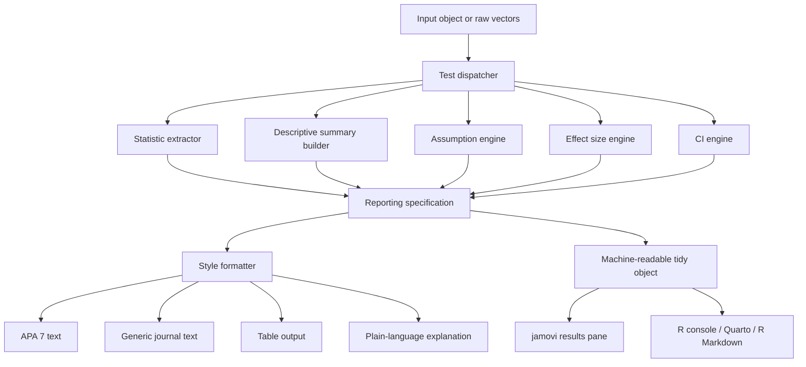

# Statistical Test Reporting Standards and Design Recommendations for an R Package and jamovi Module

## Executive summary

Across APA 7 reporting guidance, APA’s Journal Article Reporting Standards, SAMPL, and major-journal author guidance from PLOS and Nature-family journals, the broad consensus is stable: a good results sentence should identify the analysis, report the core test statistic with its degrees of freedom where applicable, provide the exact *p* value except at very small thresholds, include an effect size where the design supports one, and pair key estimates with confidence intervals rather than relying on significance language alone. Regression write-ups should additionally report coefficients, uncertainty, and model fit, while correlation and ANOVA guidance explicitly emphasizes assumptions and appropriate descriptive statistics. citeturn22search0turn22search1turn12view7turn12view5turn23search0turn23search2turn23search3turn12view8

The attached *SPSS Survival Manual* is especially valuable for package design because it provides concrete, compact exemplars for Pearson correlation, hierarchical multiple regression, independent and paired *t* tests, one-way ANOVA, two-way ANOVA, repeated-measures ANOVA, mixed ANOVA, ANCOVA, and common nonparametric tests. Those examples consistently follow a reusable pattern that is ideal for automation: state the test and substantive variables, briefly note assumption checks, then report descriptive statistics, inferential statistics, and an effect-size sentence where relevant. fileciteturn0file0

For your package, the best model is not to mimic a single source literally, but to synthesize three strengths. From **easystats**, emulate a unified API, rich effect-size support with confidence intervals, model-diagnostic helpers, and multiple output representations such as detailed text, compact text, and tables. From **moretests**, emulate the jamovi-first approach of augmenting existing analyses with additional assumption tests close to the results pane. From **APA/JARS + PLOS + Nature + SAMPL**, adopt stricter defaults: exact *p* values, confidence intervals, explicit assumptions, and complete model summaries. The gap to fill is a source-aware, style-switchable **reporting engine** that generates publication-ready sentences, explains user options in plain language, and degrades gracefully when assumptions fail or when some statistics are unavailable. citeturn3search0turn3search6turn18search2turn3search1turn15search0turn15search2turn3search2turn17search0turn6view1turn11view0turn11view1turn19view0turn12view5turn12view6turn12view7turn23search2turn23search3

My recommended default for the package is therefore: produce one concise manuscript-ready sentence by default, offer an “expanded” mode with assumption and model-fit language, compute effect sizes and confidence intervals automatically when defensible, prefer robust or Welch-style alternatives when standard assumptions are materially violated, and expose journal-style switches rather than hard-coding one reporting dialect. This is consistent with the direction of APA/JARS, SAMPL, PLOS, and Nature guidance, all of which move toward fuller reporting and away from bare “significant/non-significant” prose. citeturn22search0turn22search2turn12view7turn12view5turn23search0turn23search3turn12view8

## Cross-source reporting norms

The main official sources converge on a few non-negotiables. APA’s JARS expects findings to include effect sizes and confidence intervals or statistical significance levels; APA’s statistics guide shows exact *p* values in examples and instructs authors not to duplicate the same statistics in text and in tables or figures; PLOS requires test statistics with degrees of freedom, effect sizes and confidence intervals where appropriate, and exact *p* values for values at or above .001; Nature-family guidance similarly calls for reporting statistics in a standard “statistic(df) = value, *p* = value, effect size = value, CI = values” form and, in some journals, explicitly requires exact *p* values, effect sizes, and confidence intervals for all inferential analyses. citeturn22search0turn22search1turn22search2turn24search0turn12view5turn12view6turn23search0turn23search2turn23search3

SAMPL adds useful implementation detail that is directly relevant to software defaults. For correlation, it recommends identifying the coefficient used, confirming assumptions, reporting the coefficient value, and reporting a 95% confidence interval for primary comparisons. For regression, it recommends descriptive summaries, assumption checks, handling of outliers and missing data, the regression equation, coefficients with confidence intervals and *p* values, model-fit measures, and model validation. For ANOVA and ANCOVA, it similarly calls for descriptive statistics, assumption confirmation, handling of outliers and missing data, interaction testing, test statistics with *p* values and degrees of freedom where applicable, and a goodness-of-fit assessment. citeturn12view7

Pallant’s textbook examples line up well with those official standards and are especially practical for an automated text generator. Her reporting examples nearly always begin by naming the analysis and substantive variables, then include a stock assumption sentence such as “Preliminary analyses were conducted to ensure no violation of …” before the inferential result. For example, the correlation example includes assumptions of normality, linearity, and homoscedasticity; the multiple regression example includes normality, linearity, multicollinearity, and homoscedasticity; the ANCOVA example adds linearity, homogeneity of variances, homogeneity of regression slopes, and reliable measurement of the covariate. That consistency makes the book unusually suitable as a phrase bank for generated prose. fileciteturn0file0

A second strong pattern is the steady elevation of effect sizes and confidence intervals. easystats’ **effectsize** package treats confidence intervals as first-class outputs for Cohen’s *d*, Hedges’ *g*, eta-squared, omega-squared, epsilon-squared, generalized eta-squared, and conversions from common test statistics. easystats’ **report** package also surfaces effect sizes and their confidence intervals in text output by default for *t* tests, ANOVA, and linear models. That direction is aligned with APA/JARS, PLOS, and Nature and should be part of your core design, not an optional afterthought. citeturn3search1turn15search0turn15search2turn15search3turn18search2turn22search0turn12view5turn23search3

There is, however, one important cross-source tension your package should handle explicitly: **verbal labels for effect sizes**. easystats prints labels such as “small,” “medium,” and “large” using convention sets drawn from Cohen or Field, while SAMPL explicitly warns against calling correlations “low, moderate, or high” unless ranges have been defined. The right compromise is to calculate and report the numeric effect size by default, and make adjective labels opt-in, with the convention set exposed as an argument and fully documented. citeturn14search10turn14search14turn18search2turn12view7

For formatting, a defensible default is: two decimals for most estimates and test statistics, three decimals for *p* values, exact *p* for values ≥ .001, and “*p* < .001” below that threshold, with journal-specific overrides. That recommendation is consistent with APA’s example formatting for exact *p* values, and with explicit PLOS and Nature guidance favoring exact *p* reporting and full inferential statistics. citeturn22search2turn24search0turn12view5turn23search2turn23search3

## Unified templates by analysis family

The matrix below synthesizes the reporting elements that recur across APA/JARS, SAMPL, Pallant’s textbook examples, PLOS/Nature guidance, and easystats’ output conventions. It is designed as a **software-ready template map**, not as a claim that every journal requires every field in every sentence. The strongest consensus items are the test statistic, degrees of freedom where applicable, exact *p* value, effect size where appropriate, confidence intervals for primary estimates, and an assumptions sentence when diagnostics matter. citeturn22search0turn12view7turn12view5turn23search2turn18search2 fileciteturn0file0

| Test | Required stats | Effect sizes | CI | Assumption checks | Example sentence |
|---|---|---|---|---|---|
| Independent *t* test | Group means, SDs, *t*(df), exact *p* | Default: Cohen’s *d*; optional Hedges’ *g* | Mean difference CI; effect-size CI if available | Independence, normality, homogeneity; if unequal variances, switch to Welch | “An independent-samples *t* test showed that [group A] (M = {m1}, SD = {sd1}) and [group B] (M = {m2}, SD = {sd2}) differed [significantly/not significantly], *t*({df}) = {t}, *p* = {p}, mean difference = {diff}, 95% CI [{lwr}, {upr}], *d* = {d}.” |
| Paired *t* test | Time/condition means, SDs, *t*(df), exact *p* | Default: repeated-measures *d* or Cohen’s *d* with method named | Mean change CI; effect-size CI if available | Normality of paired differences, independence of pairs | “A paired-samples *t* test indicated that scores changed from [Time 1] (M = {m1}, SD = {sd1}) to [Time 2] (M = {m2}, SD = {sd2}), *t*({df}) = {t}, *p* = {p}, mean change = {diff}, 95% CI [{lwr}, {upr}], *d* = {d_rm}.” |
| One-way ANOVA | Group means/SDs or medians if needed, *F*(df1, df2), exact *p* | Default: η² for one-way; optional ω² | Effect-size CI if available | Independence, residual normality, homogeneity | “A one-way ANOVA showed a [significant/non-significant] effect of [factor] on [outcome], *F*({df1}, {df2}) = {F}, *p* = {p}, η² = {eta2}.” |
| Factorial ANOVA | Main effects and interactions, *F*(df1, df2), exact *p* | Default: partial η²; optional partial ω² | Effect-size CI if available | Independence, residual normality, homogeneity; inspect interactions before simple effects | “A two-way ANOVA showed a [significant/non-significant] [A × B] interaction, *F*({df1}, {df2}) = {Fint}, *p* = {pint}, partial η² = {pes}; the main effect of [A] was … ; the main effect of [B] was … .” |
| Repeated-measures ANOVA | Omnibus test, within-subject factor levels, exact *p* | Default: generalized η² or partial η²; expose both | Effect-size CI if available | Sphericity where relevant; residual normality; within-subject design integrity | “A repeated-measures ANOVA showed a [significant/non-significant] effect of [time/condition] on [outcome], *F*({df1}, {df2}) = {F}, *p* = {p}, [partial/generalized] η² = {es}.” |
| ANCOVA | Adjusted factor effects, covariate effect, *F*(df1, df2), exact *p* | Default: partial η² for omnibus terms | Effect-size CI if available | Residual normality, homogeneity of variances, linear covariate–outcome relation, homogeneity of regression slopes | “After adjusting for [covariate], ANCOVA showed a [significant/non-significant] effect of [factor], *F*({df1}, {df2}) = {F}, *p* = {p}, partial η² = {pes}.” |
| Multiple linear regression | Overall *F*(df1, df2), *R*², adjusted *R*², coefficients, SEs, *t*, exact *p* | Model-level: *R*²; predictor-level: standardized β by default, optional semi-partial *R*² / *f*² | Coefficient CIs; optional standardized-coefficient CIs | Linearity, residual normality, heteroskedasticity, collinearity, influence/outliers | “The regression model predicting [outcome] from [predictors] was [significant/not significant], *F*({df1}, {df2}) = {F}, *p* = {p}, *R*² = {r2}, adj. *R*² = {ar2}. [Predictor] was a [significant/non-significant] positive predictor, *B* = {B}, SE = {SE}, 95% CI [{lwr}, {upr}], *β* = {beta}, *t*({df}) = {t}, *p* = {ppred}.” |
| Mann–Whitney *U* | Group medians or mean ranks, *U*, often *z*, exact *p* | Default: rank-based *r*; optional rank-biserial effect size | Offer CI for optional effect size if available | Independence, ordinal/continuous outcome, shape sensitivity if interpreting medians | “A Mann–Whitney *U* test showed that [group A] (Md = {md1}) and [group B] (Md = {md2}) [did/did not] differ, *U* = {U}, *z* = {z}, *p* = {p}, *r* = {r}.” |
| Wilcoxon signed-rank | Paired medians or median change, *z*, exact *p* | Default: rank-based *r* | Offer CI for optional effect size if available | Paired design, symmetric difference distribution as a practical check | “A Wilcoxon signed-rank test showed that [Time 1] and [Time 2] differed, *z* = {z}, *p* = {p}, *r* = {r}; scores decreased from Md = {md1} to Md = {md2}.” |
| Kruskal–Wallis | Group medians or mean ranks, χ²/H(df), exact *p* | Offer optional ε² or η²\_H; for follow-ups report pairwise effect sizes | Optional CI for pairwise effects | Independent groups, ordinal/continuous outcome; interpretation sensitive to distribution shape | “A Kruskal–Wallis test showed a [significant/non-significant] difference across groups, χ²({df}) = {H}, *p* = {p}; medians were [ … ].” |
| Friedman | χ²(df, *n*), exact *p*, medians across occasions | Optional Kendall’s *W* for omnibus; *r* for pairwise Wilcoxon follow-ups | Optional CI for *W* if available | Repeated-measures ranks, paired design | “A Friedman test indicated that scores differed across [k] occasions, χ²({df}, *n* = {n}) = {chi2}, *p* = {p}. Medians changed from {md1} to {md2} to {md3}.” |
| Spearman correlation | ρ, *n*, exact *p* | ρ itself | CI for ρ for primary analyses | Monotonicity; outliers; ordinal/non-normal appropriateness | “Spearman’s rank-order correlation showed a [positive/negative] association between [x] and [y], ρ = {rho}, *n* = {n}, *p* = {p}, 95% CI [{lwr}, {upr}].” |

### Parametric mean-comparison templates

For **independent and paired *t* tests**, Pallant’s examples give a strong minimum viable template: name the test; include group or occasion means and SDs; report *t*(df), *p*, and a confidence interval for the mean difference; then add an effect-size sentence. easystats’ `report()` output is slightly richer because it puts the confidence interval directly on the mean difference and also returns Cohen’s *d* with a confidence interval, which is a better default than eta-squared for most modern psychology and biobehavioral writing. My recommendation is therefore: **default to Cohen’s *d* (or Hedges’ *g* if bias correction is requested) for between-group *t* tests, and default to a named repeated-measures *d* variant for paired designs, while optionally exposing Pallant-style eta-squared for backwards compatibility**. fileciteturn0file0 citeturn18search2turn3search1

For **one-way ANOVA**, the most stable narrative pattern is “There was a significant effect of [factor] on [outcome], *F*(df1, df2) = value, *p* = value, effect size = value,” followed by a post-hoc sentence if the omnibus result is significant. Pallant’s one-way example uses eta-squared and Tukey HSD wording; easystats’ ANOVA output uses partial eta-squared with confidence intervals and can automatically label effect sizes. A sensible package default is therefore: **η² for one-way between-subjects ANOVA, partial η² for factorial models, and ω² as an optional less-biased alternative**. For repeated-measures and mixed designs, generalized eta-squared should be offered because easystats documents its usefulness in repeated-measures contexts, while partial eta-squared remains necessary for many journal norms. fileciteturn0file0 citeturn18search2turn15search0turn15search2turn15search3

For **factorial ANOVA**, generated text should always prioritize the interaction. If the interaction is significant, report it first, then shift to simple effects or estimated marginal means rather than narrating main effects as if they stood alone. Pallant’s two-way example makes this logic explicit, and that should be hard-wired into your text generator. The package should also support post-hoc or simple-effects text that automatically switches between Tukey/Holm-adjusted pairwise tests and planned contrasts. fileciteturn0file0

For **repeated-measures ANOVA** and **mixed ANOVA**, generated text should include the within-subject levels and, when relevant, note the multivariate test or sphericity handling. Pallant’s examples use Wilks’ Lambda in repeated and mixed designs and report partial eta-squared. In software, I would expose a style toggle: one mode reports the multivariate result when that is what the fitted object gives most naturally; another mode reports the univariate result with Greenhouse–Geisser or Huynh–Feldt correction when sphericity is violated. fileciteturn0file0

For **ANCOVA**, the default template should explicitly name the covariate, state that means are adjusted, and separate the interaction from the main effects. Pallant’s ANCOVA example is especially useful because it includes assumptions specific to ANCOVA, including homogeneity of regression slopes and reliable covariate measurement. Your module should automatically change wording depending on whether the slopes test passed, because a failed slopes assumption is not a cosmetic issue; it changes the interpretation of the adjusted group comparison. fileciteturn0file0

### Regression templates and diagnostics wording

For **multiple linear regression**, the source consensus is stronger on structure than on a single preferred sentence. SAMPL expects the purpose of the analysis, descriptive statistics, assumption checks, treatment of missing and outlying data, the equation or model definition, coefficients with confidence intervals and *p* values, and a model-fit statistic such as *R*². PLOS similarly expects all estimated coefficients, standard errors, confidence intervals, *p* values, and goodness-of-fit, and even asks that full regression results be available as supporting information. easystats’ `report()` and `parameters` packages already supply a strong template: a model-level opening sentence with *R*², adjusted *R*², *F*, and *p*, followed by per-predictor coefficient, CI, test statistic, *p*, and optional standardized coefficient with CI. That should be your baseline. citeturn12view7turn12view5turn12view6turn18search2turn17search0turn17search1turn17search2

For diagnostics, I recommend two layers of generated prose. The **default prose layer** should be conservative and compact: “Inspection of residual and influence diagnostics suggested no serious violations of linearity, normality, homoskedasticity, or multicollinearity.” The **expanded diagnostics layer** should report named checks and outcomes only when requested or when something is wrong. This is consistent with Pallant’s brief assumption sentences, SAMPL’s emphasis on confirming assumptions and reporting handling of outliers and missing data, and easystats’ diagnostic tooling through `performance::check_model()` and related checks. fileciteturn0file0 citeturn12view7turn3search2turn3search5turn0search10

A practical rule for assumption-violation wording is:

- **Normality concern only, large sample, residual plots acceptable**: keep OLS or ANOVA wording but say “Residual diagnostics indicated mild non-normality; given the sample size and other diagnostics, inference was interpreted with caution.”
- **Heteroskedasticity concern**: switch to robust standard errors if available and state that explicitly.
- **Collinearity concern**: state that coefficients were unstable or interpret predictors cautiously.
- **Influential cases**: report whether conclusions changed in sensitivity analyses.

That language is not copied from a single source, but it is the most defensible synthesis of SAMPL’s requirement to report diagnostics and treatment decisions, APA/Nature’s preference for transparent reporting, and easystats’ support for robust standard errors and model checking. citeturn12view7turn12view8turn17search1turn17search3turn3search5

### Nonparametric templates and post-hoc wording

Pallant’s nonparametric chapter is particularly useful because it gives explicit prose examples for Mann–Whitney, Wilcoxon, Kruskal–Wallis, Friedman, and a note that Spearman reporting can follow the Pearson template with ρ substituted for *r*. Her Mann–Whitney and Wilcoxon examples report medians, the standardized *z* statistic, the *p* value, and an effect-size *r*, making that a very reasonable default for auto-generated text in a behavioral-science package. fileciteturn0file0

For **Mann–Whitney *U*** and **Wilcoxon signed-rank**, your generator should default to reporting medians, optional sample sizes by group or occasion, *U* or *z*, exact *p* where available, and effect-size *r*. For **Kruskal–Wallis**, the omnibus sentence should report χ²/*H*(df), *p*, and medians or mean ranks; because effect-size conventions vary more here, I recommend offering an omnibus effect size as an option rather than forcing it into the default sentence. For **Friedman**, include the omnibus χ²(df, *n*) and medians across time, with optional Kendall’s *W* if computed. For **Spearman**, use ρ itself as the core effect statistic and include a confidence interval for primary analyses, in line with SAMPL’s general correlation guidance. fileciteturn0file0 citeturn12view7

Post-hoc language should be explicit about multiplicity control. Pallant’s Kruskal–Wallis and Friedman sections both recommend Bonferroni-adjusted pairwise follow-ups. PLOS and Nature do not prescribe a single correction method here, but they do require full reporting and discourage rhetoric unsupported by formal analysis. So the package should emit sentences such as: “Pairwise Mann–Whitney tests with Holm-adjusted *p* values indicated that …” or “Post-hoc Wilcoxon signed-rank tests with Bonferroni-adjusted α showed that … .” fileciteturn0file0 citeturn23search2turn12view5

## Easystats and moretests compared

easystats is a broad ecosystem built explicitly to standardize statistical workflows and reporting in R. Its `report()` package generates detailed narrative text, concise text, and tables; `effectsize` computes standardized differences, ANOVA effect sizes, conversions from test statistics, and confidence intervals; `performance` provides model-fit summaries and diagnostic plots; and `parameters` produces coefficient tables with confidence intervals, standardized estimates, and robust standard errors or alternative variance-covariance estimators. This is not just “nice output”; it is a coherent architecture that already separates computation, diagnostics, effect-size estimation, and rendering. citeturn0search4turn3search0turn3search6turn18search3turn3search1turn15search0turn15search2turn3search2turn17search0turn17search1turn17search3

By contrast, the **moretests** repository is deliberately narrow. Its package DESCRIPTION says it “adds additional normality tests (Kolmogorov-Smirnov and Anderson-Darling) and homogeneity of variances (Bartlett’s) to the jamovi t-tests, One-way ANOVA, ANOVA, ANCOVA and linear Regression.” Inspection of the module files shows that it is implemented as an add-on to jamovi’s existing analyses; the YAML files attach to `jmv::ttestIS`, `jmv::ttestPS`, `jmv::anovaOneW`, `jmv::anova`, `jmv::ancova`, and `jmv::linReg`, and the extra output is assumption-oriented rather than narrative-oriented. citeturn6view1turn7view0turn8view0turn8view1turn8view2turn8view3turn8view4turn8view5

The backend code shows the pattern clearly. For independent-samples *t* tests, moretests adds Shapiro–Wilk, Kolmogorov–Smirnov, Anderson–Darling, Levene’s test, and a variance-ratio test. For ANCOVA it augments the default normality/homogeneity panels with Kolmogorov–Smirnov, Anderson–Darling, and Bartlett’s test. For linear regression it adds Shapiro–Wilk, Kolmogorov–Smirnov, and Anderson–Darling tests on residuals plus heteroskedasticity tests including Breusch–Pagan, Goldfeld–Quandt, and Harrison–McCabe. citeturn11view0turn20view4turn11view1turn19view0

That comparison suggests a clean division of labor for your project:

| Dimension | easystats strength to emulate | moretests strength to emulate | Gap your package can fill |
|---|---|---|---|
| Output model | Multiple representations: detailed text, summary text, table | jamovi-native augmentation of results panes | A shared reporting core that renders both R and jamovi outputs |
| Effect sizes | Rich, automatic, CI-aware effect-size computation | Minimal emphasis | End-to-end defaults for effect sizes across classical procedures |
| Diagnostics | Strong model diagnostics and fit summaries | Extra formal assumption tests close to UI | Unified “assumption engine” with plain-language explanations |
| User education | Clear package-level documentation and consistent naming | Familiar jamovi workflow | In-product explanations of what each option changes in the prose |
| Coverage | Broad model coverage | Focused add-ons for common jamovi analyses | Publication-ready write-ups for standard applied tests |
| Style control | Good defaults, but not fully journal-style-switchable | Not focused on prose styling | APA/Nature/PLOS style presets with user overrides |

The main product gap, therefore, is not another calculator. It is a **rendering and explanation layer** that sits on top of stable computations and gives users text they can use, inspect, and edit, with traceable options. citeturn18search3turn17search10turn19view0turn11view1

## Package and jamovi design recommendations

### Core design principles

The package should be organized around a single concept: **a report specification assembled from analysis metadata, descriptive statistics, inferential statistics, effect sizes, confidence intervals, assumptions, and style rules**. easystats already separates many of these concerns across packages; mirroring that modularity will make your own package easier to test and extend. citeturn18search3turn17search0turn3search2turn15search5

I recommend the following high-level architecture:

### Suggested R API

A simple but scalable API would look like this:

- `stat_report(x, style = "apa7", detail = "brief")`
- `stat_report_ttest(...)`
- `stat_report_anova(...)`
- `stat_report_rm_anova(...)`
- `stat_report_ancova(...)`
- `stat_report_lm(...)`
- `stat_report_nonparametric(...)`
- `report_table(x, style = "apa7")`
- `report_explain(x, audience = "applied")`
- `check_assumptions(x, formal = TRUE, visual = TRUE)`
- `compute_effectsize(x, standard = "default", ci = 0.95)`

Every high-level function should return an S3 object with at least:

- `text_brief`
- `text_full`
- `table_main`
- `effects`
- `assumptions`
- `diagnostics`
- `style_metadata`
- `warnings`
- `glossary`

This closely follows the spirit of easystats’ “text + table + intermediate components” but makes the reporting contract explicit for jamovi integration. citeturn3search6turn18search3

### Default user options

The defaults I would prioritize are:

| Option | Recommended default | Why |
|---|---|---|
| `style` | `"apa7"` | Most clearly specified starter style |
| `detail` | `"brief"` | Produces manuscript-ready first sentence |
| `p_format` | `"exact_3dp"` with `< .001` threshold | Aligns with APA/PLOS/Nature direction |
| `effectsize` | `"auto"` | Compute whenever defensible |
| `effect_labels` | `FALSE` | Avoid overclaiming magnitude labels by default |
| `ci_level` | `0.95` | Cross-source norm |
| `assumptions` | `"compact"` | Brief sentence unless violated |
| `robust_when_violated` | `TRUE` where supported | Better default than silently ignoring problems |
| `posthoc_adjust` | `"holm"` | Good general-purpose error control |
| `include_descriptives` | `TRUE` | Needed for readable prose |
| `include_method_name` | `TRUE` | Avoid ambiguous outputs |
| `leading_zero` | style-dependent | Expose as a formatting preset, not fixed logic |

The most important jamovi UX choice is to pair every checkbox with a one-line explanation that affects both computation and text. For example, if the user requests standardized coefficients in regression, the help text should say that the report will include β coefficients in addition to unstandardized *B* values. If the user turns on robust SEs, the output text should say that uncertainty estimates were computed with heteroskedasticity-consistent standard errors. That is consistent with the explanatory ethos of easystats and with the transparent reporting expected by SAMPL and journal guidelines. citeturn17search1turn17search3turn12view7

### Style presets

You should support at least two presets.

**APA 7 preset**
- Lowercase italic statistical symbols in text.
- Exact *p* values except below threshold.
- Confidence intervals in square brackets.
- Prefer concise narrative plus separate table when many coefficients or comparisons are involved.
- Avoid duplicating the same inferential detail in both text and figure/table. citeturn13search0turn24search0turn24search5

**Generic journal preset**
- Exact *p* values and confidence intervals by default.
- Slightly more explicit reporting of model-fit and supplementary tables, especially for regression.
- Optional leading-zero and uppercase-*P* variants exposed as formatting choices rather than assumptions about one journal family. This is warranted because PLOS and Nature examples standardize the content requirements more than the typography. citeturn12view5turn12view6turn23search2turn23search3

## Example generated outputs, tests, and implementation roadmap

### Example generated outputs

The following examples are deliberately written in the style your package should be able to produce automatically. They follow the cross-source patterns above and echo the concrete structure used by Pallant and easystats. fileciteturn0file0 citeturn18search2turn12view7

**Independent *t* test**

> An independent-samples *t* test showed that the intervention group (M = 18.42, SD = 4.31) scored higher than the control group (M = 16.03, SD = 4.07), *t*(118) = 3.09, *p* = .003, mean difference = 2.39, 95% CI [0.86, 3.92], Cohen’s *d* = 0.56, 95% CI [0.19, 0.92].

**Paired *t* test**

> A paired-samples *t* test indicated that anxiety scores decreased from pretest (M = 24.13, SD = 6.20) to posttest (M = 20.47, SD = 5.91), *t*(39) = 4.72, *p* < .001, mean change = 3.66, 95% CI [2.09, 5.23], *d*rm = 0.75.

**One-way ANOVA**

> A one-way ANOVA showed a significant effect of treatment condition on reaction time, *F*(2, 147) = 6.84, *p* = .002, η² = .09. Tukey-adjusted comparisons indicated that Condition A differed from Condition C, whereas Condition B did not differ from either A or C.

**Factorial ANOVA**

> A two-way ANOVA showed a significant Group × Time interaction, *F*(1, 96) = 5.41, *p* = .022, partial η² = .05. The main effect of Group was not significant, *F*(1, 96) = 1.88, *p* = .173, whereas the main effect of Time was significant, *F*(1, 96) = 14.62, *p* < .001, partial η² = .13.

**Multiple linear regression**

> The regression model predicting burnout from workload, supervisor support, and sleep quality was significant, *F*(3, 196) = 28.14, *p* < .001, *R*² = .30, adjusted *R*² = .29. Workload was a positive predictor of burnout, *B* = 0.42, SE = 0.08, 95% CI [0.26, 0.58], *β* = .31, *t*(196) = 5.22, *p* < .001, whereas supervisor support was a negative predictor, *B* = -0.27, SE = 0.09, 95% CI [-0.45, -0.10], *β* = -.18, *t*(196) = -3.08, *p* = .002.

**ANCOVA**

> After adjusting for baseline symptoms, ANCOVA showed a significant effect of treatment condition on follow-up symptoms, *F*(1, 87) = 7.96, *p* = .006, partial η² = .08. Adjusted means were lower in the treatment group than in the control group.

**Mann–Whitney *U***

> A Mann–Whitney *U* test showed that satisfaction scores were higher in the hybrid group (Md = 5.0) than in the in-person group (Md = 4.0), *U* = 812.50, *z* = 2.67, *p* = .008, *r* = .26.

**Friedman**

> A Friedman test indicated that confidence differed across the three sessions, χ²(2, *n* = 32) = 14.81, *p* < .001. Median confidence increased from Session 1 (Md = 3.0) to Session 2 (Md = 4.0) and Session 3 (Md = 4.5). Holm-adjusted Wilcoxon follow-ups showed increases from Session 1 to Session 2 and from Session 1 to Session 3.

### Suggested unit tests

A reporting package of this kind will fail less often on statistics than on **wording logic**, **style decisions**, and **edge cases**. I would prioritize these test classes:

| Test class | What to assert |
|---|---|
| Statistic extraction | Correct df, statistic values, coefficient names, CI bounds, group labels |
| Template routing | Correct sentence family chosen for Welch vs Student *t*; one-way vs factorial ANOVA; paired vs independent; Spearman vs Pearson |
| Assumption-routing logic | Violated homogeneity uses Welch wording; violated ANCOVA slopes assumption suppresses adjusted-main-effect prose and emits warning |
| Effect-size fallback | If direct effect size unavailable, fallback computes or omits gracefully with explicit message |
| Formatting | Exact *p* at .001 boundary; `< .001` thresholding; decimal-place control; CI bracket formatting; sign handling |
| Style presets | APA preset vs generic-journal preset produce expected symbol case and punctuation |
| Missing data | Pairwise vs listwise wording matches computation path |
| Post-hoc text | Number of pairwise comparisons, adjustment method, and contrast labels rendered correctly |
| jamovi integration | Tidy object maps to result panes, warnings, and option descriptions without silent truncation |

Concrete unit-test examples:

- `expect_match(text, "t\\(118\\) = 3\\.09")`
- `expect_match(text, "95% CI \\[0\\.86, 3\\.92\\]")`
- `expect_true(any(grepl("Welch", warnings_or_text)))` when `var.equal = FALSE`
- `expect_false(grepl("partial eta squared", text))` for independent *t* test in modern default mode
- `expect_true(grepl("homogeneity of regression slopes", assumption_text))` for ANCOVA
- Snapshot tests for full generated prose from canonical examples modeled on Pallant’s templates and easystats outputs. fileciteturn0file0 citeturn18search2turn17search10

### Recommended visualization and diagram assets

For visuals, I would ship or template the following assets:

- **Diagnostic grid** for regression and ANCOVA, inspired by `performance::check_model()`, because it provides a compact visual summary of residual behavior, normality, and influential patterns. citeturn3search2turn3search5
- **Estimated marginal means plot with confidence intervals** for ANOVA and ANCOVA, because it supports interaction interpretation better than text alone and matches journal expectations for clearly labelled uncertainty. citeturn21search8turn24search9
- **Forest-style coefficient plot** for multiple regression, showing *B* or standardized β with 95% CIs, which aligns well with PLOS/Nature expectations for complete coefficient reporting. citeturn12view5turn23search2
- **Compact post-hoc summary plot** with adjusted mean differences and multiplicity-adjusted CIs.
- **APA-style table templates** for regression coefficients and ANOVA summaries, using official APA sample-table layout as the visual reference point. citeturn1search5turn22search6

A practical implementation roadmap would be:

**First release**
- Independent and paired *t* tests
- One-way and factorial ANOVA
- Multiple linear regression
- Mann–Whitney, Wilcoxon, Kruskal–Wallis, Friedman, Spearman
- APA 7 and generic-journal style presets
- Brief/full/tidy outputs

**Second release**
- Repeated-measures ANOVA and mixed ANOVA
- ANCOVA with slopes-assumption-aware routing
- Robust/alternative inference text
- Pairwise post-hoc narrative engine
- Coefficient and estimated-marginal-means plots

**Third release**
- Deeper jamovi explanations
- User-editable phrase dictionaries
- Localization support
- Additional models and equivalence / estimation-first options

## Open questions and limitations

A few details remain source-variable rather than source-unanimous. The biggest one is **which effect size should be the default** for some procedures. For independent and paired *t* tests, Cohen’s *d* is the clearest modern default, but Pallant’s examples use eta-squared. For repeated-measures and mixed ANOVA, generalized eta-squared is often more transportable across designs, but many journals still expect partial eta-squared. For nonparametric omnibus tests, especially Kruskal–Wallis and Friedman, effect-size conventions vary more than for parametric tests. Those should therefore be **explicit user options with clear documentation**, not hidden assumptions. fileciteturn0file0 citeturn15search0turn15search3

The APA website was partially protected during browsing, so some APA 7 details were available only through search-result snippets rather than fully opened pages. I therefore treated APA as strongest on the high-level requirements that were consistently visible, such as exact *p* examples, effect sizes and confidence intervals in findings, and the general formatting of statistical notation, rather than relying on inaccessible fine-print for edge typography. citeturn22search0turn22search1turn22search2turn13search0turn24search5

Finally, the moretests repository appears intentionally sparse in public documentation. The conclusions above about its strengths and limits are based on the package DESCRIPTION and the module/backend files I could inspect, not on a richly documented user manual. That is enough to identify its architectural pattern, but not enough to infer design goals beyond added assumption testing. citeturn6view1turn7view0turn11view0turn11view1turn19view0